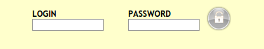

# visites-et-enterprises

This script automates the web login at CERN's favourite aparthotel using Selenium.



# set up prerequisites on Linux

Install Selenium:

```Bash
firefox release.seleniumhq.org/selenium-ide/2.8.0/selenium-ide-2.8.0.xpi
```

Install Python bindings for Selenium:

```Python
pip install selenium
```

# set up prerequisites on OS X

Install Selenium:

```Bash
/Applications/Firefox.app/Contents/MacOS/firefox release.seleniumhq.org/selenium-ide/2.8.0/selenium-ide-2.8.0.xpi
```

Install Homebrew:

```Bash
ruby -e "$(curl -fsSL https://raw.githubusercontent.com/Homebrew/install/master/install)"
```

Install PIP.

```Bash
brew install pip
```

Install Python bindings for Selenium:

```Python
pip install selenium
```

# set up login script

Download the script ```visites-et-enterprises.py```:

```Bash
wget https://raw.githubusercontent.com/wdbm/visites-et-enterprises/master/visites-et-enterprises.py
```

Change the identification and passcode specified in the script as appropriate:

```Python
identification = "Apt999"
passcode       = "wanknob"
```

Run the script to log in and access... the web.

```Bash
python visites-et-enterprises.py
```
